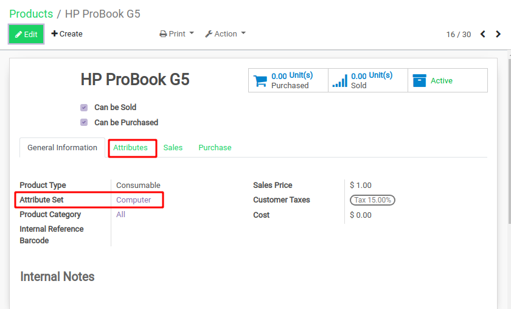

# Purchase Landed Costs

## Objectif

Le module ‘_Purchase Landed Costs_’ permet d’actualiser le prix de revient des articles en incluant tous types de frais d’approches \(transport, douane, frais de paiement…\) au prix d’achat d’origine \(de la facture du fournisseur\).

Le bouton pour accéder à l’historique du prix de revient d'un article se trouve dans l’onglet _“Information Générale”_ de la fiche article :

Il permet d'afficher un historique de ce type :

Grâce au module, on pourra donc calculer ce "nouveau prix de revient" grâce à une moyenne pondérée :

$$
Nouveau Prix = \frac{AncienStock*Ancien Prix + Arrivage*Prix Acquisition}{AncienStock + Arrivage}
$$

Avec :

* `AncienStock` la quantité d'articles en stock avant l'arrivage \(nul si négatif\)
* `AncienPrix` l'ancien prix de revient de l'article
* `Arrivage` la quantité d'articles de l'arrivage
* `PrixAcquisition` le prix total d'acquisition de l'article \(_landed cost_ en anglais\) incluant l'achat et les frais d'approche.

## Usage

### 1. Achat d'articles

Une fois le module installé, il suffit de réaliser un achat d'un article stockable. Une fois qu'on confirme la commande et que l'option _'Must be linked to Landed Costs'_ est cochée, le bouton _"Register Landed Costs"_ apparaît :

### 2. Création de l'objet _'Cost distribution'_

En cliquant sur _"Register Landed Costs"_  on créé un brouillon d'un nouvel objet _'Cost distribution'_, qui associe à une ou plusieurs _pickings lines_ \(entrée de stock d'un article\), des frais d'approches que l'on choisit :

Dans l'onglet _"Pickings Lines"_ on aura donc la liste des mouvements de stocks auxquels on veut associer certains frais d'approches. On aura généralement une _picking line_ par article. Pour comprendre les colonnes, on a :

* **Unit Price** : le prix d'achat unitaire de l'article sur la facture fournisseur
* **Amount line** : le prix total \(Quantity \* Unit Price\) de la _picking line_ sans frais d'approche
* **Cost amount** : les frais d'approche pour cette _picking line_
* **Previous cost** : l'ancien prix de revient de l'article \(cf `AncienPrix`\)
* **Acquisition cost** : le prix total d'acquisition de l'article incluant l'achat et les frais d'approches \(cf `PrixAcquisition` \)

Dans l'onglet _"Expenses"_ on aura la liste des frais d'approches associés à ces entrées de stock :

Parmi les colonnes on a :

* **Expense type** : le type de frais d'approche à appliquer. On peut les configurer dans le menu _"Costs distributions &gt; Expenses Types"_, voir en définir des "par défaut" \(qui seront présents automatiquement dans chaque nouvel objet _'Cost distribution'_\) :
* **Calculation method** : La méthode de répartition de ce frais d'approche \(défini dans les caractéristiques de la _'Expense type'_\) parmi les _picking lines_ de notre _'Cost distribution'_. On peut répartir ce frais d'approche de différentes manières : par la quantité d'articles reçus dans chaque _picking line_, le prix des articles, leur poids...
* **Expense amount** : La somme total du frais d'approche à répartir sur les différentes picking lines.
* **Affected lines** : Les picking lines de notre objet 'Cost distribution' auxquelles on souhaitent affecter ce frais d'approche
* **Supplier invoice line** : La facture associée à cette dépense de frais d'approche, à ne pas confondre avec la facture d'achat auprès du fournisseur des articles reçus.

### 3. Calcul du nouveau prix de revient

En cliquant sur _"Calculate"_ on calcule le prix de revient de nos articles présents dans l'objet _'Cost distribution'_ . Il faut ensuite cliquer sur _"Update Cost"_ pour actualiser le prix de revient \(pondéré\) des articles en question.

Il faut bien noter que la valeur du _'Acquisition cost'_ inscrite dans l'onglet _"Picking lines"_ de l'objet _'Cost distribution'_  correspond à la valeur `PrixAcquisition`  de notre calcul incluant le prix d'achat et les frais d'approches \(123,06€ dans notre exemple\). À ne pas confondre avec le nouveau prix de revient \(pondéré\) de l'article qui sera calculé et enregistré en cliquant sur _"Update Cost"_  \(28,06€ dans notre exemple\) :

## Configuration

### Bouton "Register Landed Costs"

Le bouton _"Register Landed Costs"_  est disponible non seulement sur le bon de commande lié aux articles dont on veut actualiser le prix de revient mais aussi sur le bon de livraison lié à cet achat. Cette option est disponible sur les deux objets à partir du moment où le bon de livraison est dans l'état "Prêt" ou "Terminé".

En revanche, si on crée un bon de livraison sans qu'il soit lié à un bon de commande, l'option ne sera évidemment pas disponible.

### Option "Must be linked to Landed Costs"

L'option _'Must be linked to Landed Costs'_ est automatiquement pré-remplie \(bien que restant éditable\) lorsqu'on choisit le Fournisseur, suivant l'information donnée par le champ _'Products linked to Landed Costs'_ dans la fiche du Fournisseur :

### Condition d'actualisation du Prix de revient

Le prix de revient ne sera réellement actualisé sur un produit que si la Catégorie du Produit a une méthode de calcul de coût qui est _'Coût moyen \(AVCO\)'_ :

Si la méthode sélectionner est _'Prix standard'_ ou _'First in first out \(FIFO\)'_ le prix de revient ne sera pas actualisé et l'action _"Update Cost"_ n'aura aucun effet.

